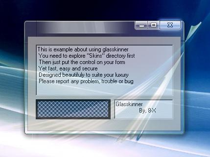



## Absolute Vista form skinner

### Description

Convert your ordanary VB form into resizable vista form.You have been looking for this for a long time.

Very fast yet very easy to use.
 
### More Info
 

             |
---                |---
**Submitted On**   |2008-05-12 06:04:20
**By**             |[Xelon Labs](https://github.com/Planet-Source-Code/PSCIndex/blob/master/ByAuthor/xelon-labs.md)
**Level**          |Advanced
**User Rating**    |4.4 (53 globes from 12 users)
**Compatibility**  |VB 3\.0, VB 4\.0 \(32\-bit\), VB 5\.0, VB 6\.0
**Category**       |[Custom Controls/ Forms/  Menus](https://github.com/Planet-Source-Code/PSCIndex/blob/master/ByCategory/custom-controls-forms-menus__1-4.md)
**World**          |[Visual Basic](https://github.com/Planet-Source-Code/PSCIndex/blob/master/ByWorld/visual-basic.md)
**Archive File**   |[Absolute\_V2112615122008\.zip](https://github.com/Planet-Source-Code/xelon-labs-absolute-vista-form-skinner__1-70529/archive/master.zip)

